# StudentForum
A basic question and answer forum 
Note : Cannot add all the photo's - For more photo checkout the folder project_photos/
 
<h1>Technology Used :  <ul>
<li>Django</li>
<li>HTML</li>
<li>CSS</li>
<li>JS</li>
<li>BOOTSTRAP</li>
</ul>
</h1>

Problems Faced : 

1 ) Whenever a teacher sends an assignment through the mail , it gets mixed up with all the other mails and gets lost , 
whenever i want to find a specific assignment i have to search through the whole mail for the particular mail.

2 ) Whenever a students had to ask a question to the teacher he has to wait for the opening of college or mail him directly ,
suppose many people get the same doubt , the teacher will be spammed with the mail, and also suppose by some reason the student
is not able to ask the teacher the question in college.

Solution : 

1 ) The assignment tab will make the work easier all the assignment related to all the courses and for particular semester will
be available in that place ,
The teacher will have the privilage to add assinments and whether to share them or not with the students of particular semester.

2 ) The student teacher interaction forum will help in asking question to the teacher or the fellow students, wheere anyone can
comment to give the answer.

3 ) chatting app will also be present which will make user to chat with each other to discuss any topic privatly.
4 ) calender app which allow the user to have events on the page which matter the most. like the exams , birthdays , deadlines of assignments etc.

<h1>Basic Authentication : Login,Logout,Signup functionalities</h1> 

<h2>Front Page after login</h2>

  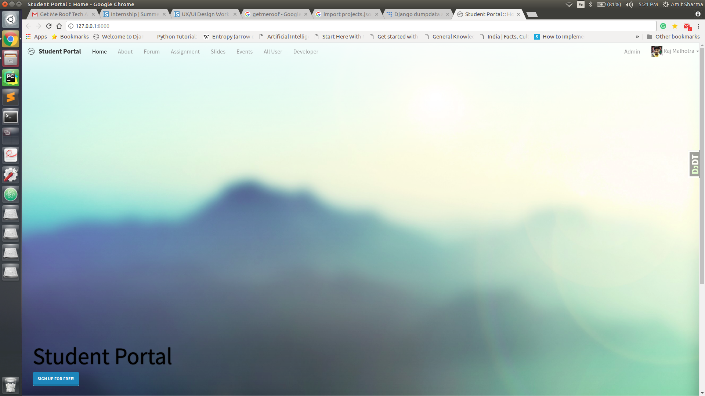

<h1>Forum Tab</h1>
<ul>
<li>
<h2>Forum App</h2>

  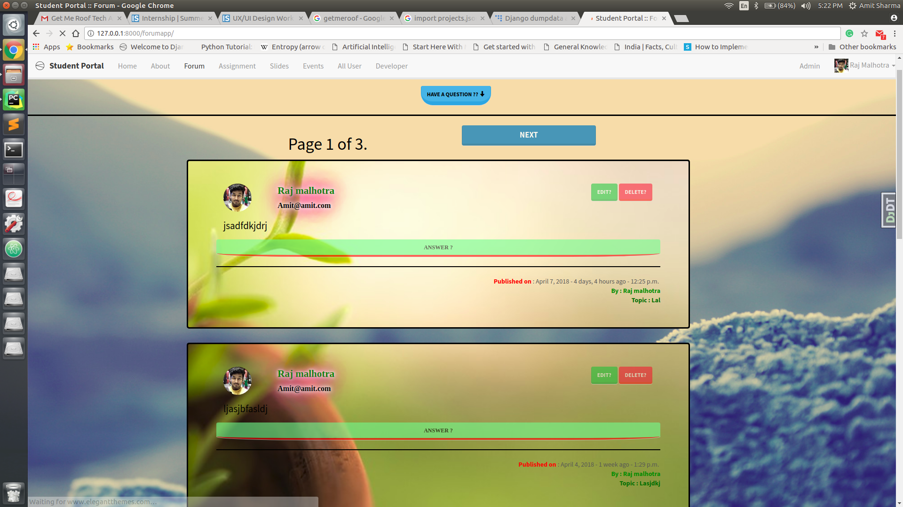
  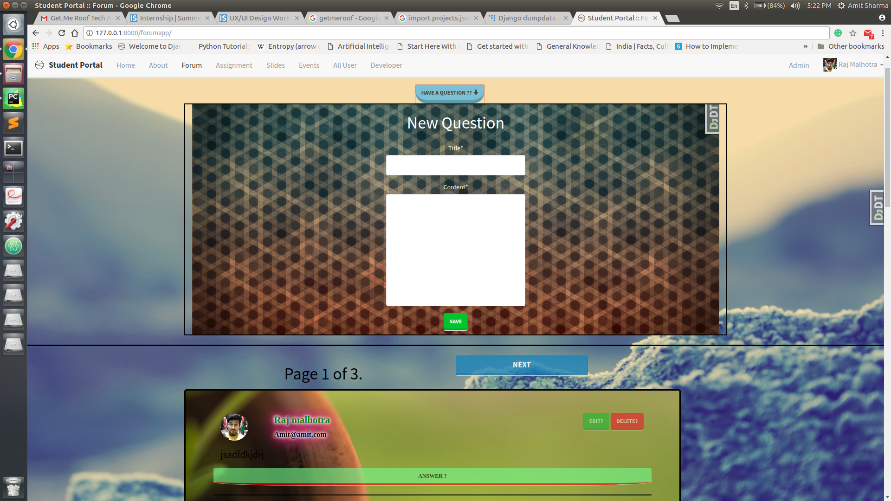

</li>
<li>
<h2>Forum App Comments</h2>

  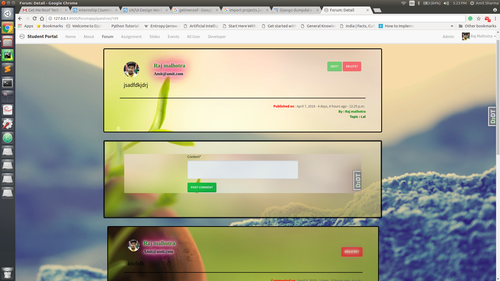
  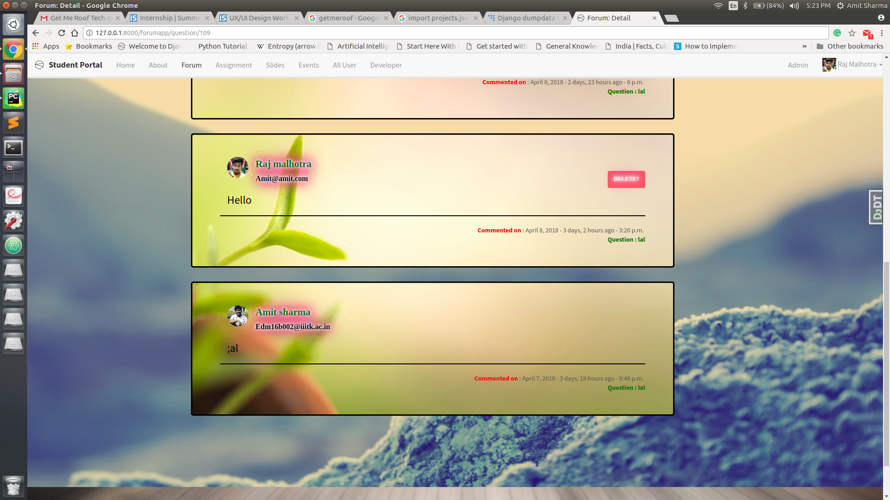

</li>
<li>
<h2>Delete Question ?</h2>

  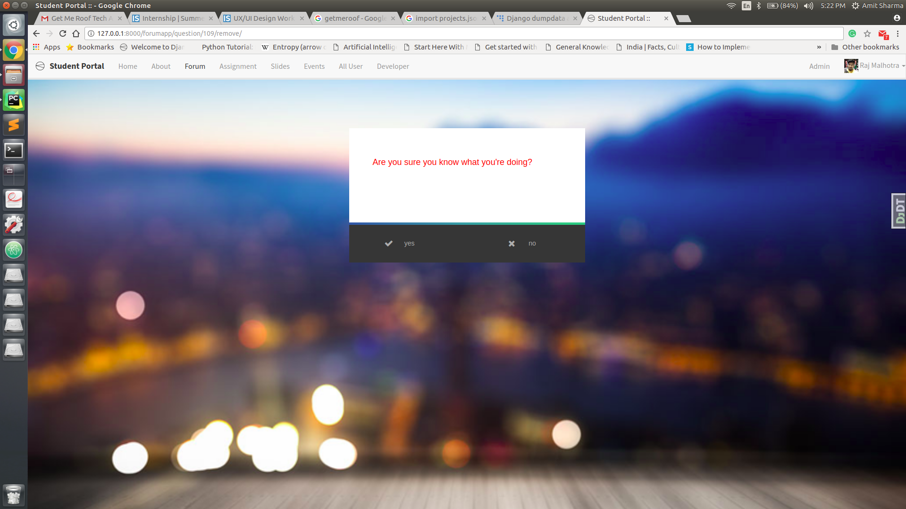

</li>

</ul>

<h1>Profile</h1>

  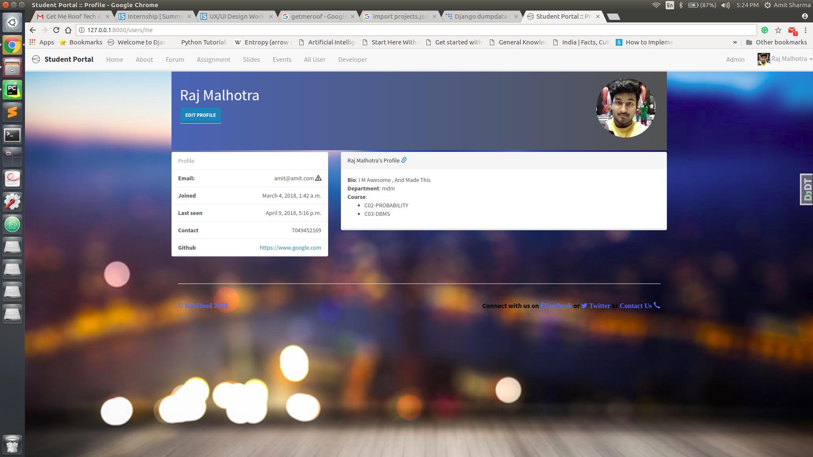

<h1>Profile Edit</h1>

  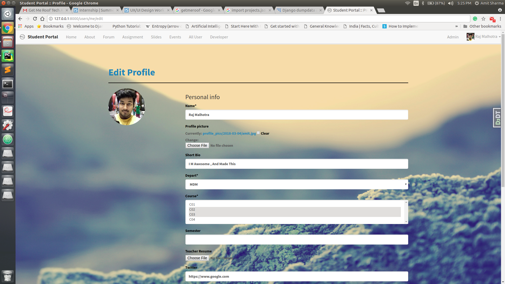

<h1>Assignment Tab</h1>
<ul><li>
<h2>Assignment Seen By Teacher</h2>

  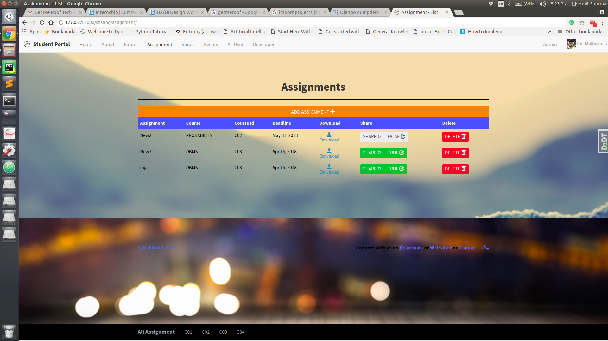

</li>
<li>
<h2>Add Assignment ? by teacher</h2>

  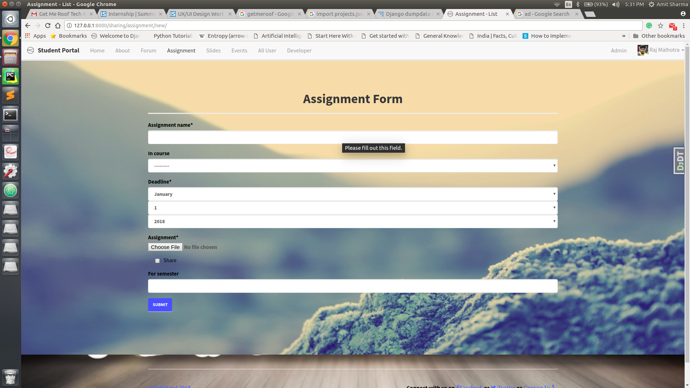

</li>
</ul>

<h1>Slides Tab</h1>
<ul><li>
<h2>Slides for teacher View</h2>

  

</li>
<li>
<h2>Slides Upload Teacher Forum</h2>

  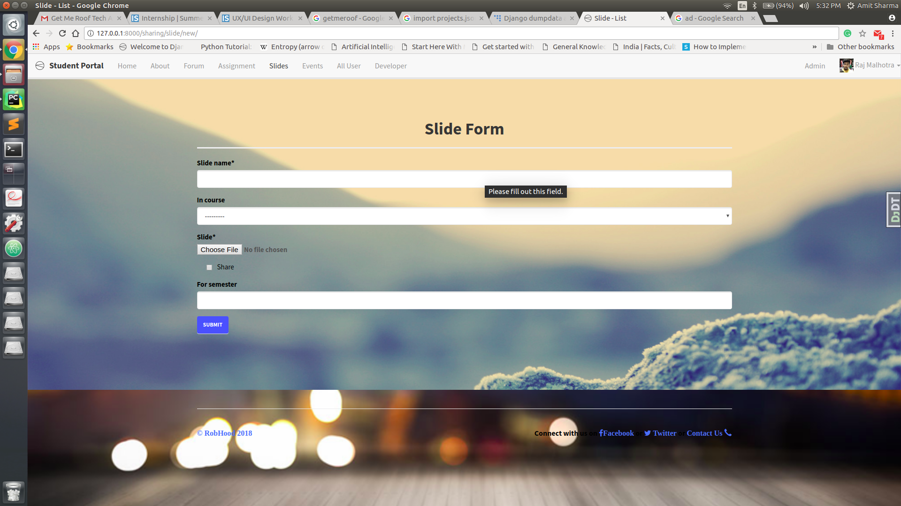

</li>
<li>
<h2>Slides View For Students</h2>

  <strong>For the student looks will be same just the share button and the delete button is removed.</strong>

</li>
</ul>

<h1>Events Tab</h1>
<ul><li>
<h2>Private Events</h2>

  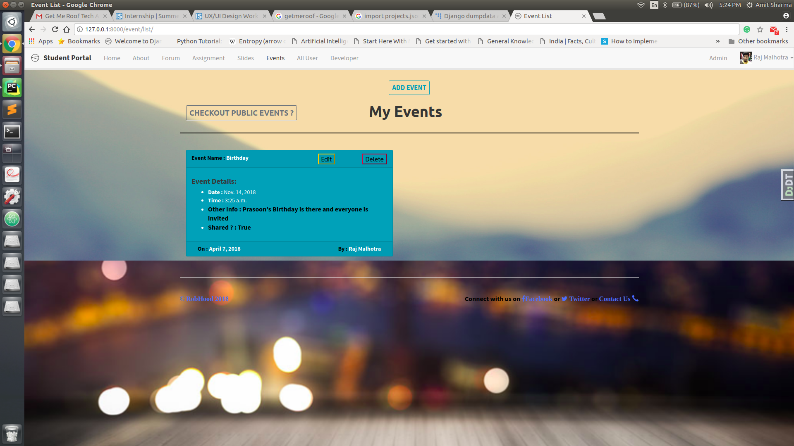

</li>
<li>
<h2>Public Events</h2>

  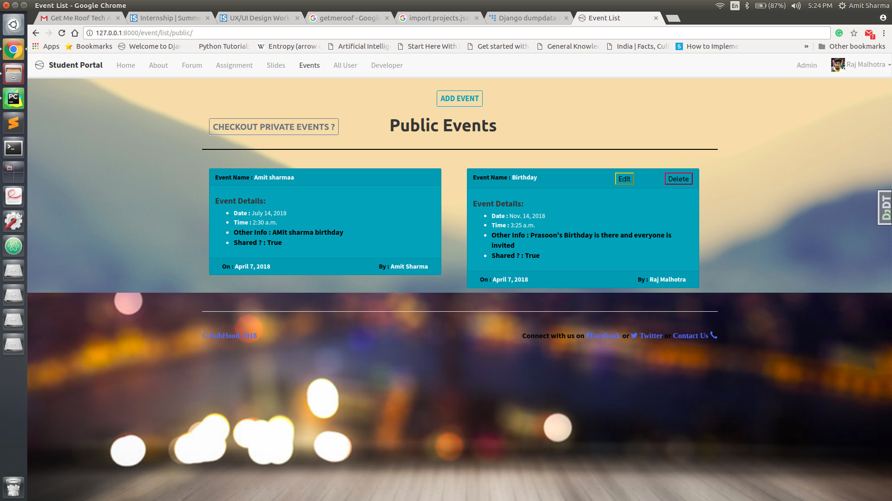

</li>
<li>
<h2>Add Event</h2>

  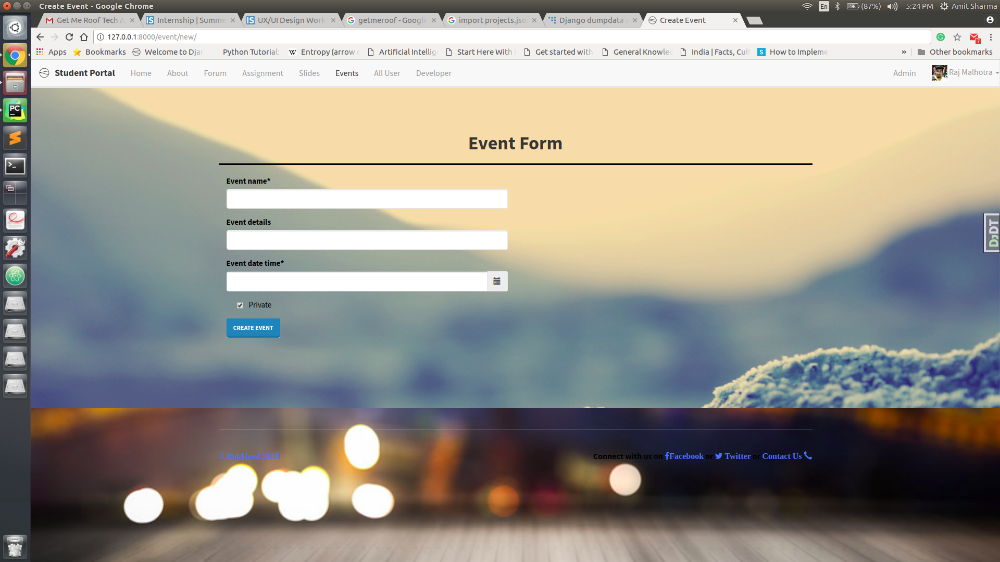

</li>
</ul>

<h1>Developers Tab</h1>

  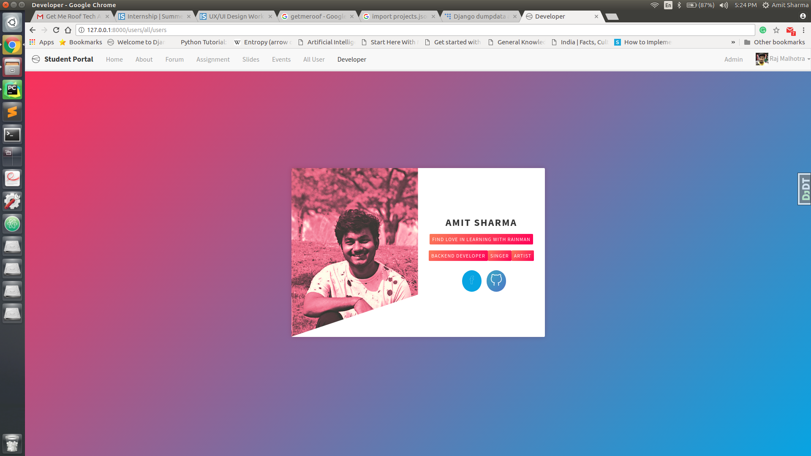

<script src="" type="text/javascript">
